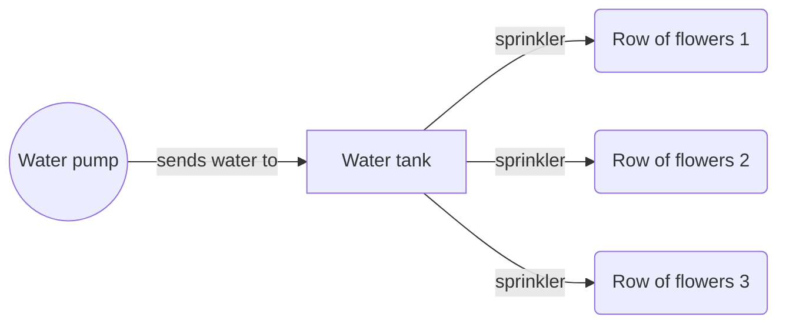

# Watering the garden flowers
## The idea
I have this beautiful garden that is of course a lot of work to maintain. 

I was thinking about automating the process of watering the plants.
To do this I will use my local well, water pump, a water tank and water lines with sprinklers to deliver water to the plants. Refer to the diagram below

## Solution
Initially the process of filling up the tank and watering the plants will be manual and controlled by an app. Assuming the inlet and outlet of the tank can be controlled, the app will have this interface:

The app will give visual aids to understand how much the tank is filled, the percentage of the capacity, inflow and outflow. It will automatically stop filling up on reaching ceratain level and resume filling up on dropping below certain level.

## Personal note
I quite enjoyed working with `UIStackView`s. Building the UI with SwiftUI uses a lot of the mechanics and ideas behind stack views, so I enjoyed that very much.
